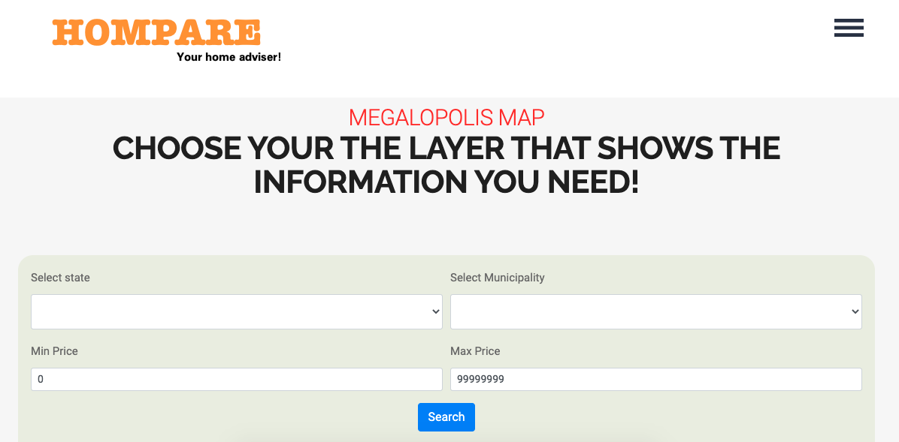
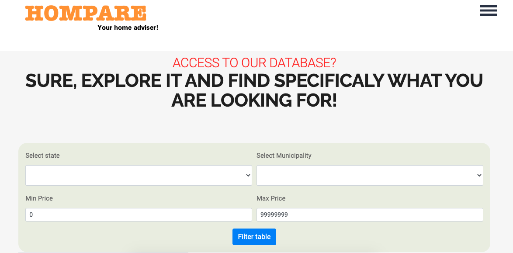

# Homepare-Final-Project

Homepare is a web application that is aimed at users that want to buy a property in Mexico. Real Estate web pages from Mexico were scraped using python to assemble the dataset. The app allows users to check the data in three different ways:

1. The first one is a dashboard made with d3.js and plotly.js that let the users compare statistics of two states and/or municipalities such as:
   * Number of properties for sale, average price, average surface, the average price per square meter, and external attributes from the house like human, education, income, and health indexes.
2. The second page is an interactive choropleth map made with leaflet.js that let the users activate or deactivate different layers depending on user selection to check important information of each state and/or municipality like:
   * The price of each record, price per square meter, GDP, Human Development Index, number of properties for sale, price range
3. The third, way of presenting the data for the users is the database, that is, each of the records scraped. Here, the user has the chance to specified a minimum and maximum price, and the information contained in the table is ID, suburb, street, description, price, and the URL that takes the user to the original announcement.

## Features

* Construction of own database using web scraping
* Data wrangling with pandas
* Use of AWS RDS with Postgres
* Visualizations made with JavaScript libraries(d3, plotly, leaflet)

## Built with

* HTML/CSS
* Bootstrap
* Flask
* Postgres
* JavaScript
* AWS RDS
* Leaflet.js
* Plotly.js
* d3.js
* Python(pandas, BeautifulSoup, Selenium, Splinter)

## Outcomes

Homepage of the application

Comparison section. The user has the opportunity to compare states of municipalities

Interactive map section. The user has the chance to activate and deactivate multiple layers from the map and to select a price range of the property

Database section. The app allows the user to select a house price range, and the information displayed contain the ID, suburb, street, description, price, and the URL that takes the user to the original announcement.

